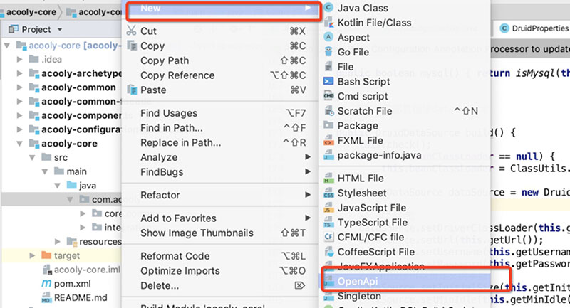

<!-- title: 开发环境  -->
<!-- type: core -->
<!-- author: zhangpu -->
<!-- date: 2019-04-30 -->

Acooly框架建议开发人员统一环境和工具，以提高效率和协作便利性。请开发人员根据各自的操作系统，进行对应的环境配置。

## 1. jdk

使用oracle jdk8以上，建议JDK8最新版本。

## 2. maven

使用maven最新版本（3.2以上即可）

请下载并统一使用: [maven\_setting\_acooly.xml](res/maven/maven-settings-acooly.xml) 替换`maven`默认setting文件，IDE中的maven插件也请配置选择该配置文件

>注意：因目前主流的公共仓库都不支持nexus代理，maven\_setting\_acooly.xml文件已经升级（2020-11-09）为阿里云公共仓库+acooly私有仓库共用模式，请各团队进行下载最新的配置文件。

## 3. IDE

推荐使用`IDEA`，并导入配置：[idea\_settings\_acooly.jar](res/ide/idea/idea_settings_acooly.jar)

>Eclipse建议使用STS插件，但我们最近几年使用的少，帮不了你。

IDEA推荐插件:

* lombok: 框架大量使用了lombok，建议项目开发中也使用，减少代码量。
* Alibaba Java Coding Guidelines: 阿里巴巴代码规范插件，统一代码格式和风格（format）

>直接IDEA的插件安装页搜索名称即可找到，然后安装。

### 文件模板

文件模板是只，你在IDEA里面创建文件时，预定义的文件初始化生成模板。配置界面：File and Code Templates

Acooly框架提供的模板中内置了常规java文件的模板（注释）和几个特殊的文件模板应用，如下：

* 类文件注释：定义了统一的文件注释和类注释，你导入后，可根据组织或项目自行调整。位置在该模块下的Includes标签下的company和File Header两个模板。
* Enum：Acooly框架约定所有业务开发中的枚举都必须实现Messageable接口，在创建时候，会自动生成对应的实现和帮助方法。
* OpenApi：Acooly的OpenApi服务开发，自定义了很多annotaion，如果是开发OpenApi服务，请直接在新建类时选择：OpenApi，会少去很多手工工作量。但请注意：类名必须以ApiService结尾。如下图：

	


### 代码模板

代码模板的定义在：settings界面的Live Template项里面。Acooly只增加了几个常用的模板，可选使用。

* 实现Messageable的枚举：`enums`，这个也可以直接使用文件模板里面创建Enum类时自动生成。
* 异常段：`tryc`,自动生成框架推荐的各层异常处理模板。

	```java
	try {
	    $END$
	} catch (BusinessException be) {
		 // 下层如果抛出了BusinessException，则直接上抛。
	    throw be;
	} catch (Exception e) {
	    throw new BusinessException();
	}
```
* 异常段：`trye`，运行时异常处理段。


## 4. 数据库

使用mysql 5.7最新版本,开发过程中，请尽量在本机安装数据库，方便操作。

