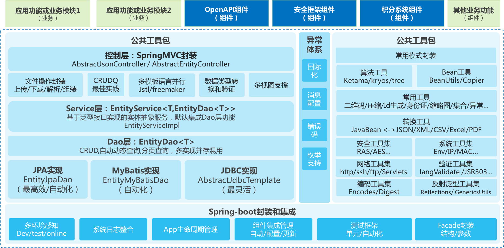
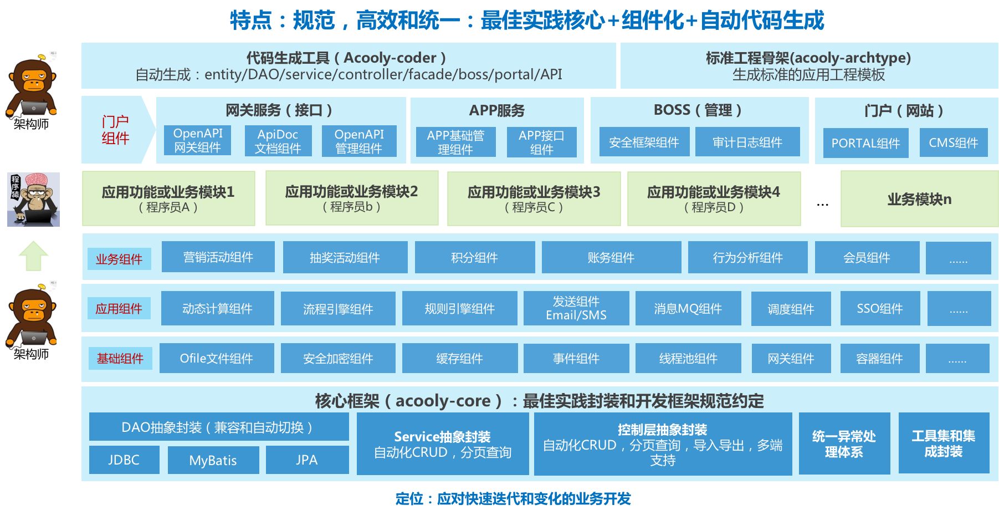
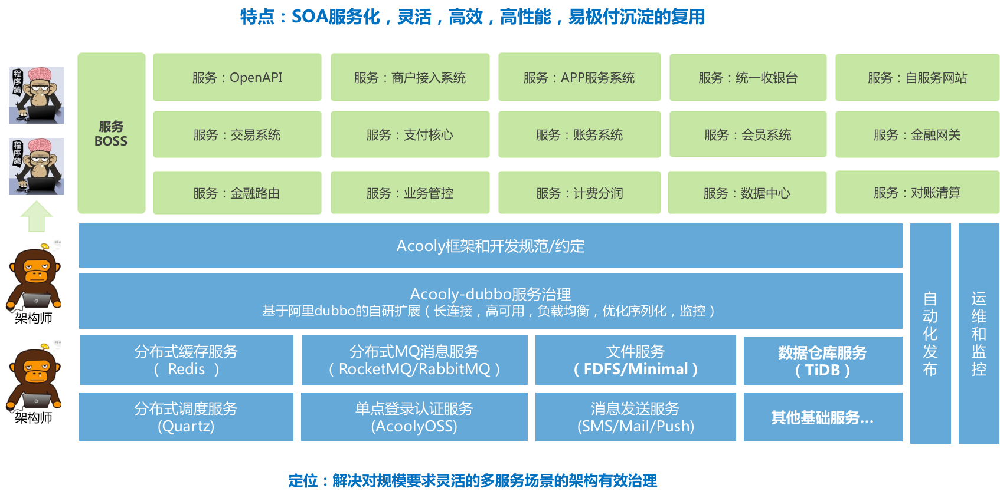
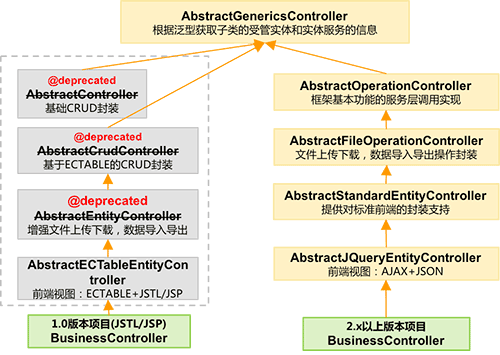
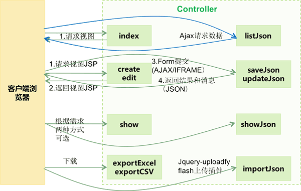

<!-- title: 后台视图开发  -->
<!-- type: core -->
<!-- author: zhangpu -->
<!-- date: 2016-1-20 -->
Acooly框架开发指南
====

# 简介

Acooly框架是基于目前业界最常用的J2EE开发基础技术栈开发的二次快速开发体系和框架。主要由框架核心，大量组件使用maven工程做集成，同时根据核心框架的开发规则和约定封装，开发了自动代码生成工具，提高开发效率。

主要的考虑模式和流程如下：

1. 使用acooly-archetype建立工程
2. 根据需求，添加对应的组件.
3. 根据acooly框架设计规范和约定完成数据库的设计
4. 使用acooly-coder连接数据库生成初始代码
5. 在工程中根据业务需求，调整生成的代码，添加新的功能
6. run，运行测试验证~


# 技术架构

## 核心架构



上图是acooly框架的主线架构，采用开源的轻量级J2EE解决方案。

* 主线技术栈：JDK8/Spring-boot/JPA/Mybatis/jsp/freemarker

* 服务采用：Dubbo（RPC）方案/CXF(SOAP)/HTTP-OpenApi开放平台解决方案

## 应用（系统）架构

应用/系统架构主要描述的是单个应用（子系统工程）的架构设计和开发模式。图中蓝色部分为acooly框架提供能力和服务支持，绿色部分是业务开发工程师只需关注业务的逻辑开发。





## 平台架构

平台架构描述的是基于SOA的平台的总体架构设计和开发模式。




# 设计规范和约定

acooly框架为方便统一封装，提高代码质量和开发效率，我们在开放技术的基础上，做了一些本领域范围的规范和约定，基于本框架的开发需要遵循这些要求，才能更好的应用框架带来的福利~

## 数据库设计约定

为了方便自动生成结构性代码，对数据库表结构设计进行部分约定，但都符合常规习惯。

* 表名全部小写，不能以数字开头，必须添加备注
* 每个表必须有以id命名的物理主键，且为数字类型，如：mysql为bigint, oracle为number。
* 列名称全部小写，不能以数字开头；如果存在多个自然单词的组合，使用下划线分隔(_)。如：`user_type`
* 列定义必须添加备注 （这个备注则为生成的页面及表单的label）
* 每个表必须添加`create_time`和`update_time`两个日期时间类型的字段，但无需手动管理 （在save/update时，框架会自己维护创建时间和最后修改时间）。
* 如果有选项类型的字段，其选项值使用类json格式写入列备注字段，自动生成工具会自动为该列对应的属性和页面生成选项。如：表列为：`user_type` ,备注可以为：用户类型 `{normal:普通,vip:高级}`

>特别注意，强烈要求选项类（自动生成枚举类的）字段项目全局唯一名称，否则会生成enum名称相同的枚举相互覆盖。

## 程序设计规范

* 实体(Entity)必须继承`AbstractEntity`,并且所有Annotation的标注采用属性标注方式（如果@Id采用属性则所有标注以属性为准）
* 采用JPA时，DAO继承`EntityJpaDao`，采用mybatis时，DAO继承`EntityMybatisDao`

> 其他约定在后续章节中逐步介绍~

# 开发介绍

本章节对业务开发中，各层开发的基础方式，重点，常规技巧和部分封装进行详细说明，以帮助使用者快速熟悉和应用框架能力。

## Entity开发

Entity原则上是与数据表一一对应的，我们一般会通过实体做数据和对象的转换对象，在Acooly框架中，我们采用Entity与Domain合并的方式进行构建和开发。下面是一个典型的实体类.

```java
@Entity
@Table(name = "SYS_USER")
@JsonIgnoreProperties({ "password", "salt" })
public class User extends AbstractEntity {
	/** uid */
	private static final long serialVersionUID = 1L;
	/** 登陆名 */
	private String username;
	/** 密码 */
	private String password;
	/** 盐 */
	private String salt;
	/** 名字 */
	private String realName;

	/** 电子邮件 */
	private String email;
	/** 手机号码 */
	private String mobileNo;
	// getter/setter
	// ...
}
```

>有几个需要注意的点：

* 尽量不要使用jpa映射关系(一对一、一对多、多对多)，很难做性能调优
* `jpa`注解标注在属性上的方案
* 使用`mybatis`时，框架也需要`jpa`注解提供单表操作能力，并且会忽略映射关系
* 必须继承`AbstractEntity`对象
* 可以使用`transient`关键字忽略属性(此属性不会映射为数据库字段)


## DAO层开发

acooly框架的DAO层开发主要采用实体开发模式，及映射表为对应的实体javabean对象，然后采用OR-Mapping或Mybatis封装进行操作。下面分别介绍下，使用JPA,MyBatis和jdbcTemplate进行DAO层开发的方案。

acooly框架的DAO层封装主要围绕核心DAO接口EntityDao进行封装，对下封装实现通用的EntityDao实现，对上（服务层）提供统一接口的EntityDao实现。

com.acooly.core.common.dao.EntityDao

```java
/**
 * 针对单个Entity对象的操作,不依赖于具体ORM实现方案.
 * 
 * @author zhangpu
 */
public interface EntityDao<T> {

	void create(T o);
	
	T get(Serializable id);
	
	void update(T o);
	
	T saveAndFlush(T entity);
	
	void flush();

	void saves(List<T> entities);
	
	void remove(T o);
	
	void removeById(Serializable id);
	
	void removes(Serializable... ids);
	
	List<T> getAll();
	
	List<T> find(String property, Object value);
	
	T findUniqu(String property, Object value);
	
	PageInfo<T> query(PageInfo<T> pageInfo, Map<String, Object> map, Map<String, Boolean> sortMap);
	
	List<T> list(Map<String, Object> map, Map<String, Boolean> sortMap);
	
}
```

### JPA

#### 封装说明

JPA(Hibernate实现)是acooly框架封装的默认DAO实现方式，也是最适合做管理类业务开发的DAO方案选择，如果你选择使用JPA方式做交易类开发，如果不是对hibernate特性特别了解，目前建议尽量减少关联配置，多采用单表+字段冗余的解决方案。

Acooly框架的DAO/JPA的封装是基于EntityJpaDao接口的，它是EntityDao的子类,同时也是JpaRepository的子类，通过了Spring-Data的JPA封装接口。

com.acooly.core.common.dao.jpa.EntityJpaDao

```java
@NoRepositoryBean
public interface EntityJpaDao<T, ID extends Serializable> extends JpaRepository<T, ID>, EntityDao<T> {

}
```

Acooly对JPA的封装是通过实现自定义的JpaRepositoryFactoryBean，为EntityJapDao提供默认封装实现，具体的实现类是：com.acooly.module.jpa.ex.AbstractEntityJpaDao

同时在动态查询方面，我们通过约定查询表单的命名规则，自动组装QBC的查询条件，实现自动化多条件，多排序分页查询。如：EQ_userNam表示：userName=该表单的值。请关注后面的详细说明

#### DAO开发

本节以示例说明JAP的DAO的常规开发，Entity类以前面的User对象为例。

框架自封装的EntityDao，请直接采用如下格式什么和建立你的DAO接口。

```java
public interface UserDao extends EntityJpaDao<User, Long> {

}
```
OK，UserDao已经完成开发，具备了基本的CRUD,分页查询等基本功能，可以直接采用接口注入方式注入任何其他spring的javabean中使用。

**问题1. 如果我有特别的查询需求怎么办？比如我要根据用户名查询User？**
你可以根据spring-data提供的JPA接口声明方式提供灵活的自定义查询解决。例如：

```java
/** 根据用户名等于方式查询用户，如果该属性是唯一索引，则可以返还单个实体对象，否则返还List */
User findByUsername(String username);

/** 根据传入的用户名做like查询 */
List<User> findByLikeUserName(String username);

/** 根据用户名和状态组合查询 */
User findByUserNameAndStatus(String username,int status);

/** 根据用户名或手机查询用户，结果采用Desc排序 */
List<User> findByUserNameOrMobileNoDesc(String username,String mobileNo);

```
以上代码提供的是根据用户名查询User的DAO自动代理方法。原则是什么！？

* 所有的查询都以findBy开头。
* 可以接多个接条件关键字(可选，无则表示=)+属性名称，多组查询条件间采用关系关键字连接（Or 或 And）
* 每个关键字，属性，条件连接单词间都采用驼峰格式
* 每组查询条件依次对应该方法的参数
* 注意like条件是不会自动带%的，需要在传入值中传入%，但是可以使用contaits代替。

具体的查询语法和规则请参考：http://docs.spring.io/spring-data/data-jpa/docs/current/reference/html/#jpa.query-methods.query-creation

**问题2：我觉得还是不能满足我的需求，比如：我需要传入一个参数，然后匹配用户名，邮箱和手机号码，只要配置任何一个就返回！？**
没问题，我们需要采用@Query查询方式定义查询接口。如下：

```java
/** 
* 采用@Query方式个任意命名的接口方法，定义一个查询SQL，这里是JPQL，然后通过?+参数序号(第一个参数为1)的方式在SQL中注入参数值 
*/
@Query("from User where username = ?1 or email = ?1 or mobileNo = ?1")
User getAuthenticateUser(String key);

// 下面是一些其他实例

/** 如果我们是更新SQL(insert,update,delete),需要增加@Modifying */
@Modifying
@Query("update User set loginFailTimes = 0 where username = ?1")
void clearLoginFailureCount(String username);

/**
* 使用原生SQL查询，注意，对于直接返回数字类型的SQL，JAP只能支持BigInteger,BigLong,BigDecimal等类型。
*/
@Query(value="select sum(t1.income) from anyOtherTableName t1 where t1.customerId = ?1",nativeQuery = true)
BigInteger getUserTotalIncome(Long id);
	
```

**问题3：热，我现在想做个黑复杂的
查询，也许是多个表关联查询返回个自定义结构，并不是某个实体怎么办？报表经常有这种需求吧？有时候为了提高综合性能和控制力度也需要吧？**

😡~，你是对的，肯定会有这种需求！我们采用JPA扩展DAO方式解决，在扩展DAO中你可以使用任何持久化技术来扩展是你的DAO，如：jdbc或者mybatis。下面我们看下怎么扩展UserDao

第一步：新建一个名称为UserCustomDao的接口，在该接口中声明你需要的特别DAO接口。

```java
public interface UserCustomDao {
	/** 自定义分页查询 */
	PageInfo<User> customeQuery(PageInfo<User> pageInfo, Map<String, String> map);

	/** 自定义查询返回DTO对象 */
	List<UserDto> queryDto(Map<String, Object> map);
}
```

第二步：新增一个名称为UserDaoImpl的类实现UserCustomDao，下面以JdbcTemplate的方式来实现扩展Dao

```java
public class UserDaoImpl extends AbstractJdbcTemplateDao implements UserCustomDao {

	@Override
	public PageInfo<User> customeQuery(PageInfo<User> pageInfo, Map<String, String> map) {
		String sql = "...";
		return super.query(pageInfo, sql, User.class);
	}

	@Override
	public List<UserDto> queryDto(Map<String, Object> map) {
		String sql = "select user_name as userName,password, user_type as userType from sys_user where 1= 1";
		//根据条件，动态组装sql
		return super.queryForList(sql, UserDto.class);
	}

}
```

>注意：
>
>* 扩展Dao实现类的命名规则必须为：EntityDao接口名称（本例为UserDao）+ Impl，则为：UserDaoImpl
>* 如果使用JDBC实现，实现类强烈建议继承AbstractJdbcTemplateDao，该抽象类封装了查询和分页查询，并自适应适配MySQL和Oracle.
>* 该实现类，无需添加@Respository或其他Spring的

第三步：在主Dao接口上继承扩展接口，对上整合为一个Dao服务。

```java
public interface UserDao extends EntityJpaDao<User, Long>, UserCustomDao {

}
```

OK,完成~

#### 动态查询

Acooly框架在JPA封装中，对动态分页查询对了全栈封装，要使用自动分页查询，需要从视图层的表单命名上遵循移动的约定。

>处理原理：通过对表单的名称命名做特定约定，由控制层手机参数后，一路透传到JAP的动态查询方法（query和list），由封装方法通过命名约定自动解析和组装多条件分页查询。特别的，自动多条件查询

**查询条件表单命名规则：search\_条件关键字\_实体类属性名称**

实例：

* search\_EQ\_userName: 表示：userName=表单值
* search\_LLIKE\_userName 表示 userName like ‘%表单值’
* search\_RLIKE\_userName 表示 userName like ‘表单值%’
* search\_GT\_startTime 表示 startTime > 表单值
* search\_GTE\_startTime 表示 startTime >= 表单值
* search\_LT\_startTime 表示 startTime < 表单值
* search\_LTE\_startTime 表示 startTime <= 表单值
...

支持的条件关键字：EQ, NEQ, LIKE, LLIKE, RLIKE, GT, LT, GTE, LTE, IN, NOTIN, NULL, NOTNULL,


### MyBatis

框架对mybatis的支持非常强大。可以不用写一行sql，完成单表的增删改查。


	package com.acooly.showcase.demo.mapper;

	import com.acooly.module.mybatis.EntityMybatisDao;
	import com.acooly.showcase.demo.domain.Customer;

	public interface CustomerMapper extends EntityMybatisDao<Customer> {

	}


有些场景我们需要编写sql，mapper文件定义到`src/main/resources/mybatis/**/*Mapper.xml`路径。注意：新增mapper中的`id`不能和EntityMybatisDao接口中定义的方法明重复。


### Jdbc

Jdbc的Dao实现主要是使用JdbcTemplate的Acooly扩展实现AbstractJdbcTemplateDao，在该类中，注入了标注的jdbcTempale实例，同时提供了自适应MySQL和Oracle的多条件，分页查询或集合查询。


## 服务层开发

服务层以EntityService接口为基础，通过泛型自动识别和从spring容器注入对应的EntityDao，实现Dao层提供的CRUD和分页查询。

## 控制层开发
根据经验，在有视图的业务场景中，控制层的开发工作量其实相对比较大，所以我们考虑，为了提高开发效率和代码质量，在控制层做了大量的常用功能的“最佳实践（相对来说）”的封装。同时与服务层及一下封装的功能提供无缝对接，提供基于实体的CRUD,分页查询，导入，导出等功能的统一封装实现。

### 封装说明

#### 继承体系




针对我们的目的，我们总体封装的思路包括以下几点：

* 无缝对接后端服务层对实体的封装功能。
* 通过泛型实现实体及服务的识别和自动注入
* 独立封装所有功能的模板方法，提供后端服务的控制车原则功能。
* 对文件相关的操作，包括导入，导出（内存和自动分页），上传和下载统一封装
* 统一控制层的错误处理
* 对JSON的返回提供统一的模型
* 对通用视图和特定视图的控制流提供默认实现。

#### 统一Json返回结构

如果你的控制层开发有选择使用AJAX方式请求，要求直接返回数据，框架已在控制层做好对应的相关配置。强烈建议所有AJAX方法的返回对应都是统一封装提供的JsonResult及其子类。


#### AJAX处理流程



视图与控制层的交易模式，如果采用AJAX方式，上图是框架中推荐的交互模式。

1. 首先通过访问控制器的视图渲染方法，初始化视图数据，然后返回浏览器显示。
2. 然后在通过浏览器端的组件或AJAX方法访问控制器的数据获取方法，拉取数据。
3. 浏览器可以多次拉取数据后，渲染显示数据。


## 视图层开发

视图层目前支持jsp/jstl和freemarker两种视图层语言开发，框架会自动根据springMVC的执行返回，搜索对应的视图，采用freemarker优先，其次为jsp方式匹配，一旦找到后，缓存并在整个进程生命周期有效。

### 视图渲染

#### JSP/JSTL

标准JSTL和JSP规范开发支持，无需特别说明，对JSP做了常规安全处理，网上流行的安全问题都不会存在~

JSTL参考：http://docs.oracle.com/javaee/5/jstl/1.1/docs/tlddocs/

注意：由于servlet 3.0规范，jsp需要放到如下路径：`src/main/resources/META-INF/resources/WEB-INF/jsp`

#### freemarker

不需要任何配置

注意：freemarker需要放到如下路径：`src/main/resources/templates`

#### 静态资源

静态资源放到如下路径：`src/main/resources/static`
